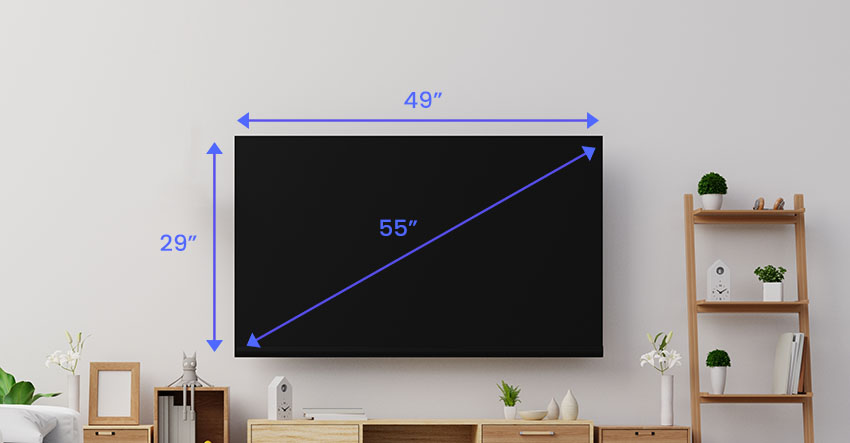
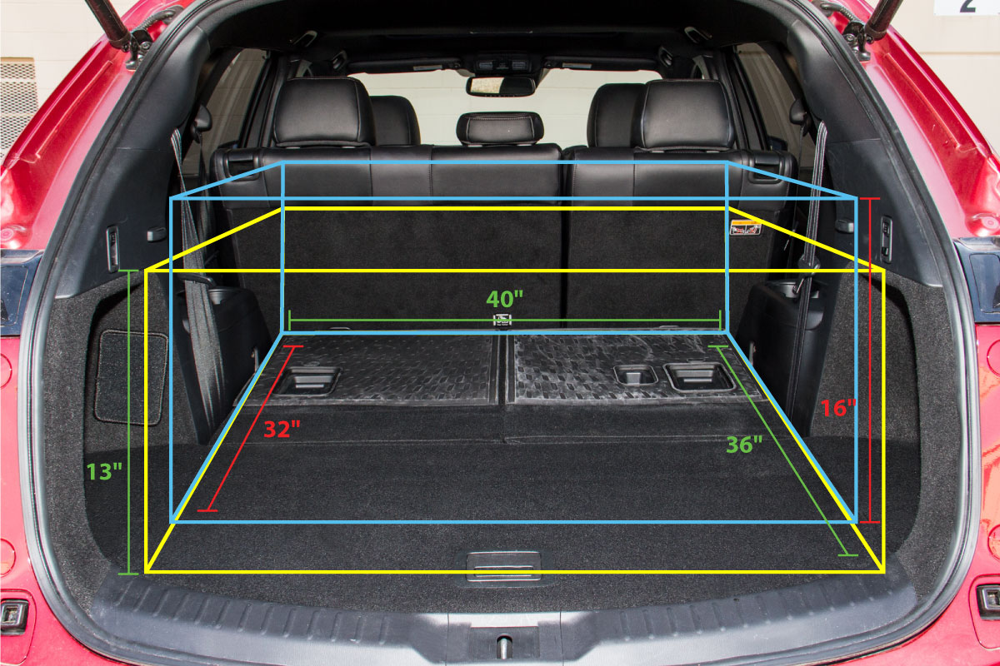
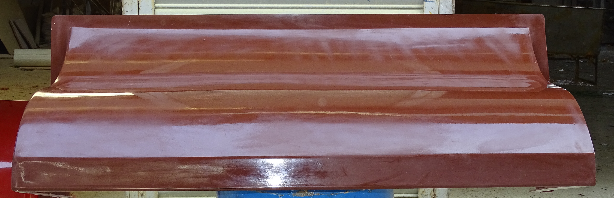
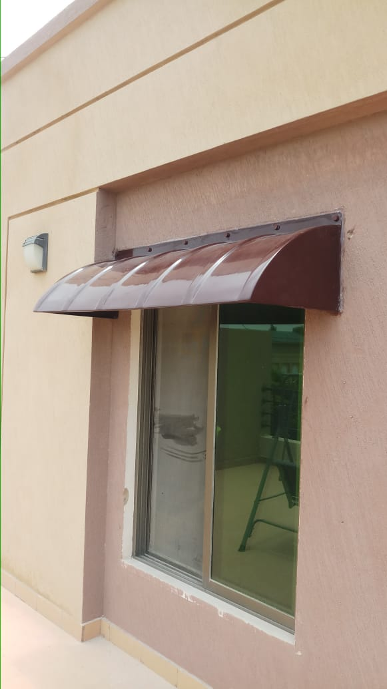

# AI-powered-Installation-and-Fittings

People often make mistakes taking measurements of everyday items. How many times have you forgotten a measuring tape when going to best buy to get a new TV, only to realise it won't fit in your car?
Luckily, we all cary our phones and finding out if a product will fit in the car or on your desk should not be too much work.

 In this project, we will build a program to identify measurements of an object using computer vision and identify whether it will fit in a particular area.

 Moreover, interviewing a manufacturing company who are skiptical of online sale, compains that costumers do not know how to take measurements and in order to produce a correctly sized product, they have to send people to locations to get correct sizing. This can be made a lot easier if we could just show measurements digitally. 

 In short, we will focus on resolving thw following two scenarios in this project.

 ### Scenario 1: Will this TV fit in my car?
 

 ### Scenario 2: Will this window shade fit over my window?
  
 
 
 ## Dataset 
 
 https://www.kaggle.com/datasets/nderalparslan/dwsonder
 https://www.kaggle.com/datasets/lasaljaywardena/furniture-images-dataset
 https://cvml.comp.nus.edu.sg/furniture/index.html
 
 ## References
 
 https://pyimagesearch.com/2016/03/28/measuring-size-of-objects-in-an-image-with-opencv/
 https://www.ijitee.org/wp-content/uploads/papers/v8i6s4/F10860486S419.pdf
 https://www.keyence.com/ss/products/vision/visionbasics/use/inspection03/
 https://pysource.com/2022/11/29/measure-size-of-objects-in-real-time-with-computer-vision-opencv-with-python/
 https://www.zillow.com/tech/training-models-to-detect-windows-doors-in-panos/
 
 
